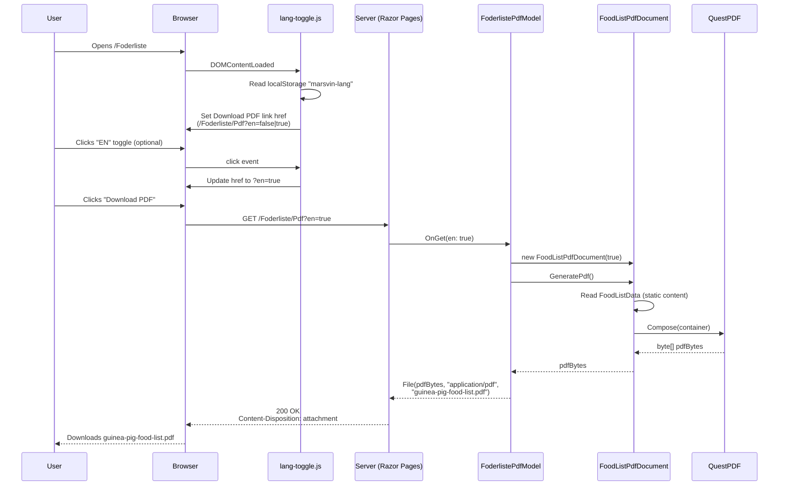

# Marsvin website architecture

This is the companion to `DATABASE-ARCHITECTURE.md` - that one explains the
data layer, this one explains **the web application itself**: how a request
becomes a response, how the site is organised, how login/roles/security
work, how the bilingual DA/EN toggle works, and how it's tested. For
operational how-tos (starting the project, credentials, resetting the DB),
see `DATABASE-NOTES.txt`.

## 1. Tech stack

- **ASP.NET Core 9, Razor Pages** - not MVC (no separate `Controllers/` +
  `Views/` split) and not Blazor. Each page is a pair of files: a `.cshtml`
  (the HTML/Razor view) and a `.cshtml.cs` (the `PageModel` behind it,
  holding the `OnGet`/`OnPost*` handlers).
- **Plain ADO.NET, no ORM** - see `DATABASE-ARCHITECTURE.md` §1.
- **Cookie authentication** (`Microsoft.AspNetCore.Authentication.Cookies`)
  - no ASP.NET Core Identity, no JWTs, no external auth providers. A hand-
    rolled claims principal, described in §4.
- **No frontend framework** - no React/Vue/etc., no build step, no NPM
  dependency for the site itself. Styling is one hand-written CSS file
  (`wwwroot/css/site.css`); JavaScript is four small, single-purpose files
  under `wwwroot/js/` - `lang-toggle.js` (the DA/EN swap, see §6),
  `confirm-delete.js` (delegated `confirm()` dialogs, see §9),
  `print-button.js` (the Print button, see §7), and `check-email.js` (polls
  for the "check your email" login flow, see §4) - everything else is
  server-rendered Razor and plain HTML forms.
- **MailKit** for real SMTP email (see §8).
- **QuestPDF** (Community licence) for the server-generated PDF downloads
  on `/Foderliste` and `/PasningsguideHurtig` (see §7).
- **xUnit** for tests, in a separate `marsvin-web.Tests` project, with two
  distinct testing strategies (see §10).

## 2. Project layout

```
marsvin-web/
  Pages/            - every route in the site: one .cshtml (+ .cshtml.cs) per page
                      PageModelExtensions.cs - CurrentUserId/CurrentDisplayName/SignInAsync/
                      IsSafeLocalUrl, shared across every page model that needs them
  Data/             - IXxxStore interfaces, SqlXxxStore implementations, DbInitializer, email
  Models/           - plain C# classes/enums the stores read and write (Animal, Order, Shift, ...)
  wwwroot/          - site.css, favicon.svg, and js/ (lang-toggle.js, confirm-delete.js,
                      print-button.js, check-email.js) - static files served as-is
  Program.cs        - composition root: DI registrations, middleware pipeline, startup
  appsettings.json  - connection string, SMTP host/port (not credentials - see below), base URL
  DATABASE-NOTES.txt / DATABASE-ARCHITECTURE.md / WEBSITE-ARCHITECTURE.md - project docs

marsvin-web.Tests/
  Data/             - store tests, against a real (disposable) SQL Server LocalDB database
  Pages/            - PageModel tests, both direct-construction unit tests and full-HTTP ones
  TestAuth.cs, MarsvinWebAppFactory.cs, CookieJar.cs, HttpTestHelpers.cs - shared test plumbing
```

Nothing in `Pages/` is orphaned scaffolding - every `.cshtml` file
corresponds to a real, reachable route (Razor Pages' convention-based
routing turns `Pages/Marsvin/Details.cshtml` into the route
`/Marsvin/Details`, `Pages/Admin/Schedule/Index.cshtml` into
`/Admin/Schedule`, and so on - folder structure *is* URL structure).

## 3. Request pipeline (`Program.cs`)

In order, on every request:

1. **`app.UseDeveloperExceptionPage()`** (Development only) **/
   `app.UseExceptionHandler("/ServerError")` + `app.UseHsts()`** (everywhere
   else) - an unhandled exception outside Development lands on `ServerError`,
   an honest "something went wrong" page. Kept deliberately separate from
   `Error` (see below), whose copy is 404-flavoured and would otherwise tell
   a confused user their crash was a broken link.
2. **`app.UseStatusCodePagesWithReExecute("/Error")`** - re-executes the
   pipeline against `Error` for any response that reaches here with an
   error status and no body yet - an unmatched route, or an explicit
   `NotFound()`/`Forbid()` result from a page handler - instead of leaving
   the visitor looking at a blank page.
3. **A small inline `app.Use(...)` middleware** sets security headers on
   every response - `X-Content-Type-Options`, `X-Frame-Options`,
   `Referrer-Policy`, and a `Content-Security-Policy` locked to `'self'`
   for scripts and styles (there is no inline `<script>`/`<style>`/`style=`
   anywhere in the project, so neither needs `'unsafe-inline'`).
4. **`app.UseHttpsRedirection()`** - redirect plain HTTP to HTTPS (in
   production; LocalDB/dev runs over plain HTTP on `localhost:5080`, which
   is why `appsettings.json`'s `App:BaseUrl` defaults to `http://...`).
5. **`app.UseStaticFiles()`** - serves `wwwroot/*` directly, no page code
   involved.
6. **`app.UseRouting()`** - matches the request path to a Razor Page.
7. **`app.UseRateLimiter()`** - enforces the `"auth"` policy (see §4) on
   Login/Register/ForgotPassword; everything else is unthrottled.
8. **`app.UseAuthentication()`** - reads the auth cookie (if any) and builds
   the `ClaimsPrincipal` that every page sees as `User`.
9. **`app.UseAuthorization()`** - enforces `[Authorize]`/
   `[Authorize(Roles = "...")]` attributes on the matched page; an
   unauthenticated request to a protected page redirects to
   `/Account/Login`, an authenticated-but-wrong-role request redirects to
   `/Account/AccessDenied`.
10. **`app.MapRazorPages()`** - hands off to the matched `PageModel`'s
    `OnGet`/`OnPost` handler.

Before any of that, at the very top of `Program.cs`,
**`DbInitializer.EnsureCreatedAndSeeded(connectionString)`** runs
synchronously - the database exists and has its schema applied before the
web server ever starts accepting requests (see
`DATABASE-ARCHITECTURE.md` §6).

Also registered as a `Singleton` hosted service:
**`InactiveAccountCleanupService`** (a `BackgroundService`) - it runs
independently of any request, once a day, for as long as the app process is
alive (see `DATABASE-ARCHITECTURE.md` §7).

### Dependency injection

Every `IXxxStore` is registered `Scoped` (one instance per HTTP request) as
a lambda that closes over the connection string read once from
configuration - e.g.:

```csharp
builder.Services.AddScoped<IUserAccountStore>(_ => new SqlUserAccountStore(connectionString));
```

`ICatalog`/`ICatalogAdmin` are the one exception with two interfaces
mapping to a single registered `SqlCatalog` instance per request (so admin
edits and customer-facing reads within the same request share one
connection rather than each interface getting its own). `IEmailSender` is
the other exception - registered `Singleton`, because it's stateless
(just wraps an SMTP client per send) and there's no reason to spin up a new
one per request. Which concrete type it maps to depends on configuration:
`SmtpEmailSender` if `Email:Username` is set, otherwise `LoggingEmailSender`
(see `DATABASE-ARCHITECTURE.md` §7) - so the app works out of the box with
no SMTP setup.

Also registered: `AddRateLimiter` with an `"auth"` `SlidingWindowLimiter`
policy (50 requests/minute, partitioned by client IP) applied via
`[EnableRateLimiting("auth")]` on `LoginModel`, `RegisterModel`, and
`ForgotPasswordModel` - generous enough not to throttle normal use or a
shared-IP test run, while still capping scripted abuse.

## 4. Authentication & authorization

### Roles

Three roles, stored as a `TINYINT` on `Users.Role`: **Customer** (`0`),
**Employee** (`1`), **Admin** (`2`). Customers always self-register at
`/Account/Register` - there's no way to create a Customer account any other
way. Employee/Admin accounts are provisioned either by seeding (several
demo accounts - see `DATABASE-NOTES.txt` for the full list) or by an
existing Admin from `/Admin/Users`.

Pages restrict access with `[Authorize]` (any signed-in role) or
`[Authorize(Roles = "Admin")]` / `[Authorize(Roles = "Admin,Employee")]` on
the `PageModel` class. A handful of pages go further than the role
attribute allows and check inside the handler itself
(`if (!User.IsInRole("Admin")) return Forbid();`) - used wherever only part
of a shared page needs restricting (e.g. `/Admin/Schedule` is reachable by
both roles, but only an Admin may create/delete a shift or decide a day-off
request).

### The login flow: password *and* an email link

This is more involved than typical cookie auth, and worth walking through
end to end:

1. **`LoginModel.OnPostAsync`** - verifies email + password
   (`PasswordHasher<ApplicationUser>`, PBKDF2). If correct, it does **not**
   sign the user in yet. Instead it generates a random 256-bit token
   (`RandomNumberGenerator`), stores only its SHA-256 hash in
   `dbo.PendingLogins` (via `IPendingLoginStore.Create`), and emails the raw
   token as a link to `/Account/ConfirmLogin?token=...` - then redirects to
   `/Account/CheckEmail` ("we sent you a link").
2. **`ConfirmLoginModel.OnGetAsync`** - hashes whatever token is in the URL,
   looks it up (`IPendingLoginStore.Consume`, single-use, 15-minute expiry).
   If it matches an unexpired row, *this* is the point that actually calls
   `HttpContext.SignInAsync(...)` and creates the real session cookie -
   also the point `Users.LastActiveAt` gets refreshed
   (`IUserAccountStore.RecordActivity`), not the password-check step.
3. If the token is missing, wrong, expired, or already used,
   `ConfirmLogin.cshtml` just shows "log in again" - no session is created.

Confirming the link typically happens in a *different* browser tab (the one
the email client opened it in) than the "we sent you a link" tab the user
was left on. `wwwroot/js/check-email.js` closes that gap: since cookies are
shared across tabs of the same browser, it polls `/Account/Profile` with
`redirect: 'manual'` every couple of seconds from the `CheckEmail` tab, and
auto-navigates once that fetch comes back authenticated - i.e. once some
other tab has confirmed the link - instead of leaving the user stuck on a
"check your email" page that never updates itself.

This means a correct password is necessary but not sufficient - proof of
access to the account's own inbox is also required, every single time,
regardless of role (unless TOTP is enabled - see below, which replaces
this email step with a faster real-time factor instead of stacking on top
of it). Failed attempts escalate via `LoginLockoutTracker` (a Singleton, in-
memory - demo-scale, wouldn't survive an app restart or work across
multiple instances in a real deployment): every failure sets a
progressively longer delay (3^attempts seconds, capped at 5 minutes), the
3rd emails the account owner a "did you do this?" notice, and the 5th sets
a hard lockout that time alone can't lift - only `ResetPasswordModel`
calling `Clear()` on a successful password reset does. Entries requiring
that hard reset are excluded from the tracker's own time-based pruning
(everything else still expires after an hour), so the escalation can't
silently wear off on its own. `Login`/`Register`/`ForgotPassword` are
additionally rate-limited per client IP (see §3) - a second, coarser layer
that also stops one attacker from re-locking a victim's account on demand,
which the per-email lockout alone can't.

### Optional second factor: TOTP (`Account/Profile`, `Account/VerifyTotp`)

A self-built RFC 6238 implementation (`Data/Totp.cs`, HMAC-SHA1 only - no
new dependency): the same standard behind Google/Microsoft Authenticator.
Real MitID integration isn't reachable for a local demo (it requires being
a registered, certified Danish service provider with government-issued
certificates), so this is an honest, working stand-in rather than a mock.

Enrollment (`ProfileModel`) is two steps on purpose: `OnPostStartTotpEnrollment`
generates and stores a secret with `TotpEnabled` still false, then
`OnPostConfirmTotp` only flips it true once the user proves they actually
saved it correctly by producing one valid code - enabling it unconditionally
the moment a secret exists would risk locking someone out with a QR code
they never actually scanned. `OnPostDisableTotp` requires the current
password, the same re-check every sensitive Profile action does.

For a TOTP-enrolled account, `LoginModel.OnPostAsync` skips the email-link
step entirely after a correct password and redirects straight to
`VerifyTotpModel` with a `PendingLogins` token (created but never emailed -
it's redeemed in the same browser session, not fetched from an inbox
later, so it's valid for 5 minutes rather than 15).
`VerifyTotpModel.OnPostAsync` peeks the ticket (`IPendingLoginStore.Peek`,
read-only - unlike `Consume`, a wrong code doesn't burn the token, so the
user can retry until it actually expires), validates the code against
`LoginLockoutTracker` the same way a wrong password does (a 6-digit code
is only 1-in-a-million odds, so it needs the same brute-force protection),
and only calls `Consume` + `SignInAsync` once a code actually checks out.

**`RegisterModel` goes through the exact same confirmation step**, reusing
`ConfirmLoginModel` unchanged: it creates the account, then - instead of
signing in immediately, which never actually proved the registrant owns
that address - sends its own confirmation link the same way `LoginModel`
does, and redirects to `/Account/CheckEmail?purpose=register` (same page,
a `purpose` query param just swaps the copy). Opening that link is what
signs the new account in for the first time.

### Forgotten passwords: `ForgotPassword` / `ResetPassword`

The same `PendingLogins` mechanism, repurposed: `ForgotPasswordModel`
looks up the email, and - only if it matches an *active* account - creates
a token and emails a link to `/Account/ResetPassword?token=...`. Either way
(match or not) it redirects to the same `CheckEmail?purpose=reset` page
with identical wording, so the form can't be used to test which addresses
are registered. `ResetPasswordModel.OnGet` calls the read-only
`IPendingLoginStore.IsValid` to tell a visitor up front that a dead link is
dead, without spending it; `OnPost` calls `IPendingLoginStore.Consume` (the
same single-use consumption `ConfirmLoginModel` uses) and, if it's still
valid, hashes the new password and calls `IUserAccountStore.UpdatePassword`,
then emails the account owner that it changed (ASVS 2.5.5 - every auth-
factor change is notified, not just this recovery path; `ProfileModel`'s
self-service email/password change does the same) - no sign-in happens
here, the visitor is sent to `/Account/Login` to sign in with the new
password through the normal confirmed flow.

### The session itself

`HttpContext.SignInAsync` builds a `ClaimsPrincipal` with four claims
(`NameIdentifier` = UserId, `Email`, `Name` = DisplayName, `Role`), backed
by an `HttpOnly`, `SameSite=Lax` cookie (`Secure` too, outside Development -
see §8) that expires after 8 hours of inactivity (sliding). Every page that
needs "who is this" calls the `PageModel.CurrentUserId()`/
`CurrentDisplayName()` extension methods in `Pages/PageModelExtensions.cs`,
which read those same two claims - collapsed there instead of being
repeated in each PageModel (which is how it used to work; six near-identical
private `CurrentUserId` properties were the concrete instance of duplication
that motivated pulling it out). `SignInAsync` itself (the claims-building)
lives there too, for the same reason - it used to be copied into
`RegisterModel`, `ConfirmLoginModel`, and `ProfileModel` independently.

Changing your name/email/password on `/Account/Profile` re-issues the
session (`SignInAsync` again) so the header immediately reflects the new
name instead of waiting for the next login.

## 5. Site map

### Public storefront (no login required)

| Route | What it is |
|---|---|
| `/` (`Index`) | Home page - available guinea pigs, hero content |
| `/Marsvin` | Full guinea pig listing |
| `/Marsvin/Details/{id}` | One guinea pig's profile, add-to-cart |
| `/Tilbehor` | Accessories listing, searchable and filterable by category |
| `/Pasningsguide`, `/PasningsguideHurtig` | Full and "quick" care guides (printable) |
| `/Foderliste` | Food safety list (printable) |
| `/OmOs`, `/Kontakt`, `/BetalingOgLevering` | About/contact/payment&delivery info pages |
| `/Privatliv` | GDPR privacy policy - what's collected, retention, rights |

### Account (`/Account/*`)

| Route | What it is |
|---|---|
| `/Account/Register` | Customer self-registration -> sends confirmation email |
| `/Account/Login` | Password check -> sends confirmation email |
| `/Account/ForgotPassword` | Request a password-reset email (same response whether or not the address is registered) |
| `/Account/ResetPassword` | Consumes the reset token, sets a new password |
| `/Account/CheckEmail` | "We sent you a link" interstitial - copy varies by `?purpose=` (login/register/reset) |
| `/Account/ConfirmLogin` | Consumes the emailed token, creates the session (shared by Login, Register, and no one else) |
| `/Account/Profile` | Name/email/password, order history (Customer), work hours + day-off requests (Employee/Admin), self-delete account (Customer) |
| `/Account/Logout` | Signs out |
| `/Account/AccessDenied` | Shown on a role mismatch |

### Cart & checkout (Customer only)

| Route | What it is |
|---|---|
| `/Cart` | Cart contents, quantity updates |
| `/Cart/Payment` | Delivery choice (pickup, or ship whatever's shippable) + demo payment form (no real card processing) |
| `/Cart/Confirmation` | Order receipt after checkout |

### Staff area - `/Admin` ("Personale")

Restricted to Admin + Employee. Deliberately holds **only** staff/people
concerns:

| Route | What it is |
|---|---|
| `/Admin/Users` | Account management - all roles, create staff, change role/active, delete (Admin only) |
| `/Admin/Schedule` ("Vagtplan") | Shift assignment (Admin) / own shifts (Employee); day-off requests and their approval; rejects an overlapping shift or one falling on approved time off |
| `/Admin/AuditLog` ("Logbog") | Who changed what, and when - every admin/employee write action (Admin only) |

### Shop management - `/Admin/Shop` ("Butiksstyring")

Also Admin + Employee, but everything here is about running the *shop*, not
the *staff* - split out from the staff area specifically because they're
different concerns (see the commit history for why):

| Route | What it is |
|---|---|
| `/Admin/Stock` | Stock levels, animal availability - Admin + Employee |
| `/Admin/Orders` | Every order placed in the shop, who placed it, how it's being delivered - Admin + Employee |
| `/Admin/Products`, `/Admin/Products/Edit` | Accessory catalog CRUD - Admin only |
| `/Admin/Animals`, `/Admin/Animals/Edit` | Guinea pig catalog CRUD - Admin only |
| `/Admin/Promotions`, `/Admin/Promotions/Edit` | Time-boxed discounts - Admin only |

## 6. The bilingual DA/EN system

Danish is the default, hard-coded language of every page's markup; English
is a **client-side swap**, not a second copy of every page or a
localisation resource file. The mechanism, end to end:

1. Every piece of user-facing text carries a `data-en="..."` attribute
   alongside its Danish text:
   ```html
   <h2 data-en="Staff area">Personale</h2>
   ```
2. `wwwroot/js/lang-toggle.js` finds every `[data-en]` element on
   `DOMContentLoaded`, remembers the original Danish text, and swaps
   `textContent` between the two based on a `localStorage` preference -
   toggled by the `EN`/`DA` button in the header. `data-en-aria-label`,
   `data-en-alt`, `data-en-placeholder`, and `data-en-href` do the same for
   `aria-label`/`alt`/`placeholder`/`href` attributes that aren't visible
   text - `data-en-href` is what lets the food list's and quick guide's
   "Download PDF" link point at the Danish or English PDF (see §7).
3. The `<title>` tag participates in the exact same generic `[data-en]`
   mechanism: every page sets both `ViewData["Title"]` (Danish) and
   `ViewData["TitleEn"]` (English) in its `@{ }` block, and
   `_Layout.cshtml`'s `<title data-en="@ViewData["TitleEn"] - Marsvin">`
   just works with the same swap code - no special-casing needed for the
   browser tab title.

No page is ever served twice for the two languages, and nothing here needs
a round-trip to the server to switch - it's a pure client-side text
substitution, remembered per browser via `localStorage`.

## 7. PDF downloads

`/Foderliste` and `/PasningsguideHurtig` each offer two separate actions,
split because they do genuinely different things:

- **Print** (`data-print`, handled by `wwwroot/js/print-button.js`) just
  calls `window.print()` - the browser's own print dialog, for an actual
  paper copy (or whatever "save as PDF" the browser's Destination dropdown
  happens to offer, which varies by browser/OS and isn't something the site
  controls).
- **Download PDF** is a real, server-generated PDF (selectable text, not a
  screenshot) built with QuestPDF (Community licence, set once via
  `QuestPDF.Settings.License` in `Program.cs`). No dialog, no browser
  dependency.

The content for each PDF is *not* rendered from the page's own Razor
markup - it's a hand-maintained mirror in `Data/FoodListData.cs` /
`Data/QuickGuideData.cs` (both typed as `GuideListItem`/`GuideListSection`,
`Models/GuideListSection.cs`), consumed by `Data/FoodListPdfDocument.cs` /
`Data/QuickGuidePdfDocument.cs`. The two pages existed first and had been
through several rounds of review, so mirroring them was lower-risk than
making them data-driven - the tradeoff is these have to be kept in sync by
hand when either page's content changes.

The download link's `href` swaps between the Danish and English PDF using
the same `data-en-*` pattern §6 describes for `aria-label`/`alt`/
`placeholder`, extended in `lang-toggle.js` to cover `data-en-href`:



`PasningsguideHurtig` follows the identical shape through
`PasningsguideHurtigPdfModel` / `QuickGuidePdfDocument` / `QuickGuideData`.
Both endpoints are public - no auth needed, matching the pages themselves.

## 8. Email notifications

These trigger a real email (`IEmailSender` -> `SmtpEmailSender`, MailKit,
Gmail SMTP, or `LoggingEmailSender` if no credentials are configured - see
`DATABASE-ARCHITECTURE.md` §7):

| Trigger | Sent to | Where in the code |
|---|---|---|
| Login attempt with a correct password | The account itself | `LoginModel.OnPostAsync` |
| A new account registers | The address just registered | `RegisterModel.OnPostAsync` |
| A password-reset is requested (only if the email matches an active account) | The account itself | `ForgotPasswordModel.OnPostAsync` |
| A checkout completes | The buyer | `Cart/PaymentModel.OnPostAsync` |
| Account approaching the 2-year inactivity cutoff (2 months out, then 1 month out) | The customer | `InactiveAccountCleanupService` |
| An Employee submits a day-off request | Every active Admin | `ProfileModel.OnPostRequestTimeOffAsync` |
| An Admin adds or removes a shift | That specific staff member | `Admin/Schedule/IndexModel.OnPostCreateAsync` / `OnPostDeleteAsync` |

All of these share the same `IEmailSender.SendAsync(toEmail, subject, body)`
shape - plain-text email, no HTML templates, no queue (sent synchronously,
inline in the request/background-job that triggered it).

## 9. Security practices (a summary - see the code comments for the "why")

- **SQL injection**: every query is parameterised, no exceptions -
  see `DATABASE-ARCHITECTURE.md` §5.
- **Passwords**: PBKDF2 via `PasswordHasher<ApplicationUser>`, never
  compared or stored as plain text.
- **Login tokens**: only ever stored as a SHA-256 hash
  (`PendingLogins.TokenHash`) - the raw token exists only in the email.
- **CSRF**: Razor Pages' built-in antiforgery token on every form
  (`asp-validation-summary`/form tag helpers wire it in automatically) -
  the end-to-end HTTP tests (§10) specifically verify a request without a
  valid token is rejected.
- **IDOR (Insecure Direct Object Reference)**: anywhere a request carries
  an ID for something owned by a user (an order to reorder, for instance),
  the store method takes *both* the ID and the current user's ID and only
  returns a match if they agree (`IOrderStore.FindForUser(orderId, userId)`)
  - a stranger's order ID just looks like "not found," never leaks its
  contents.
- **Open-redirect prevention**: anywhere a `returnUrl` comes back from a
  form/query string, it's checked against `PageModelExtensions.IsSafeLocalUrl`
  (exactly one leading slash, not `//host/evil` or `/\host/evil`) before
  ever being used in a redirect - a plain `static` method rather than
  `PageModel.Url.IsLocalUrl`, because the latter needs framework services
  that aren't available when a PageModel is constructed directly in a unit
  test (see §10).
- **Self-protection on staff management**: an Admin can't change their own
  role, deactivate, or delete themselves from `/Admin/Users`; the *last*
  active Admin account can't be demoted, deactivated, or deleted by anyone,
  full stop - the shop can never end up with zero admins.
- **GDPR**: `/Privatliv` documents what's collected and why; a customer can
  delete their own account at any time from `/Account/Profile` (right to
  erasure); inactive accounts are deleted automatically after 2 years, with
  warning emails first (see `DATABASE-ARCHITECTURE.md` §7); past orders
  survive account deletion but are orphaned, never personally identifiable
  again.
- **Security headers + CSP**: set on every response by a small inline
  middleware in `Program.cs` (see §3) - `X-Content-Type-Options`,
  `X-Frame-Options: DENY`, `Referrer-Policy`, and a `Content-Security-Policy`
  with no `'unsafe-inline'`.
- **Rate limiting**: `Login`/`Register`/`ForgotPassword` are throttled per
  client IP (see §3/§4), on top of (not instead of) the per-email lockout.
- **No inline event handlers with interpolated data**: a destructive
  action's confirmation dialog reads its message from a `data-confirm`
  attribute (HTML-encoded by Razor) via `wwwroot/js/confirm-delete.js`,
  rather than building a JavaScript string directly inside
  `onsubmit="confirm('...')"`. The latter is unsafe even though Razor
  encodes the value: the browser decodes an attribute back to raw
  characters *before* parsing it as JS, so an admin- or customer-supplied
  name could still close the string and run script in whoever clicks the
  button's session. Reading the same value from a data attribute instead
  never has it parsed as code.
- **Checkout row locking**: `SqlOrderStore.Checkout` uses
  `WITH (UPDLOCK, HOLDLOCK)` on its stock/availability read, closing a race
  where two concurrent checkouts could otherwise both pass validation for
  the same last unit (see `DATABASE-ARCHITECTURE.md` §5).
- **Audit log**: every admin/employee write action (a price/stock/role
  change, a deletion, a staff account being created) is recorded with who
  did it and when (`/Admin/AuditLog`, `IAuditLogStore`) - the
  accountability half of the role-based access control described above.

## 10. Testing - two layers

### Layer 1: direct `PageModel`/store unit tests

Most of `marsvin-web.Tests/Pages/**` and all of `marsvin-web.Tests/Data/**`
construct a `PageModel` or `SqlXxxStore` directly in C#
(`new ProfileModel(...)`) rather than going over HTTP. `PageContext` is
built by hand (`TestAuth.ContextFor(userId, role)` for a fake signed-in
user), and dependencies are either the real `SqlXxxStore` classes (against
a dedicated, disposable `MarsvinDb_Test` database created and dropped per
test run by `SqlCatalogFixture`) or small recording test doubles for things
that shouldn't really happen in a test - `RecordingAuthenticationService`
(captures what `SignInAsync` was called with, instead of touching real auth
middleware) and `RecordingEmailSender` (captures what would have been sent,
instead of hitting real SMTP).

This is fast and lets a test assert on a `PageModel`'s C# properties
directly (`model.ErrorMessage`, `model.Shifts`, ...), but it deliberately
bypasses `[Authorize]`, routing, antiforgery, and the real cookie - those
are framework-level concerns this layer can't see.

### Layer 2: full end-to-end HTTP tests

`EndToEndAuthTests.cs` and `EndToEndCartTests.cs` (plus `WebAppCollection`)
instead boot the *entire real app* in-process via `MarsvinWebAppFactory`
(`WebApplicationFactory<Program>`, pointed at its own disposable
`MarsvinDb_WebTest` database) and drive it with a real `HttpClient` -
actual HTTP requests through the actual middleware pipeline: routing,
`[Authorize]`, antiforgery, the real `Set-Cookie` header. `CookieJar` is a
deliberately manual cookie store (not `HttpClientHandler`'s automatic one)
because these tests need to inspect the raw `Set-Cookie` header itself
(checking the `HttpOnly` flag is actually set, checking a cookie really
expires on logout) and sometimes deliberately send a *mismatched* or
missing antiforgery token to prove a forged request gets rejected - both
need manual control that an automatic cookie container would hide.

Since Register/Login no longer sign a session in directly (see §4),
these tests complete the confirmation step with
`HttpTestHelpers.CompleteEmailConfirmation` - it inserts a self-generated
token directly into `PendingLogins` (the same trick used throughout this
project for manual verification, since only a token's *hash* is ever
stored) and then GETs `ConfirmLogin` with it, rather than trying to
intercept a real email. This layer is also where an authenticated-but-
wrong-role POST is proven to get redirected to `AccessDenied` by the real
middleware (`SignedInEmployee_PostingToAnAdminOnlyHandler_...`) - layer 1's
equivalent tests only prove the PageModel method itself returns
`Forbid()`, not that the framework actually turns that into the right
HTTP response.

Together, the two layers cover both ends: layer 1 checks the *logic* is
right in isolation and cheaply, layer 2 checks the *whole request actually
behaves correctly* when nothing is mocked or bypassed.

## 11. Frontend conventions (`wwwroot/css/site.css`)

A few reusable patterns worth knowing before touching a page's markup:

- **`.toast` / `.toast--error`** - the fixed-to-the-viewport popup used for
  every one-off notification ("added to cart", form errors after a
  redirect). Rendered *once*, globally, in `_Layout.cshtml`, reading
  `TempData["ToastMessage"]`/`TempData["ErrorMessage"]` - any page that
  wants to show one just sets its `[TempData]`-attributed `ToastMessage`/
  `ErrorMessage` property and redirects; it does not render its own toast
  markup.
- **`.status` + `.status--*`** - small coloured badges, originally for
  animal availability (`ledig`/`reserveret`/`solgt`) and reused for
  day-off-request status (`pending`/`approved`/`denied`) with the same base
  class and new colour modifiers.
- **`.admin-table`** - the shared table style for every admin/staff list
  page (Accounts, Schedule, Products, Animals, Promotions, Orders, AuditLog).
- **`.callout` / `.callout--danger`** - a bordered info box; the `--danger`
  variant (the site's one red, `#7A1F3D`) is reserved for irreversible or
  negative actions (delete account, day-off denied).
- **`.search-box`** - the search input + button pairing (currently just
  `/Tilbehor`), styled to match `.auth-form input`.
- **`[data-en]` / `[data-en-aria-label]` / `[data-en-alt]` /
  `[data-en-placeholder]`** - see §6.
- **`data-confirm`** - not a styling hook, but worth knowing alongside the
  above: read by `confirm-delete.js` (see §9) to show a `confirm()` dialog
  before a destructive form submits, without ever building that dialog's
  text as an interpolated JavaScript string.

There is no CSS framework (no Bootstrap/Tailwind) - `site.css` is one
hand-written file, organised by page/section with a comment above each
non-obvious rule explaining the *why*, not the *what*.
