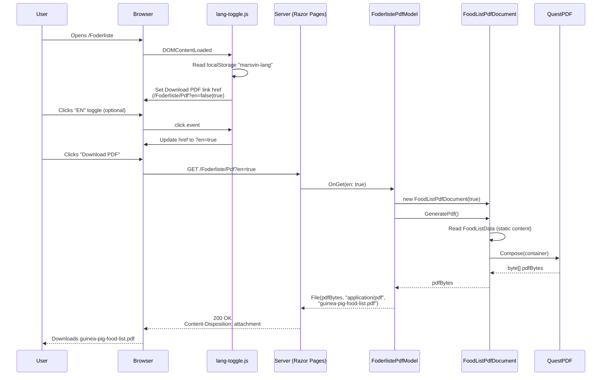

# Marsvin website architecture

This is the companion to `DATABASE-ARCHITECTURE.md` - that one explains the
data layer, this one explains **the web application itself**: how a request
becomes a response, how the site is organised, how login/roles/security
work, how the bilingual DA/EN toggle works, and how it's tested. For
operational how-tos (starting the project, credentials, resetting the DB),
see `DATABASE-NOTES.txt`.

## 1. Tech stack

- **ASP.NET Core 9, Razor Pages** - not MVC (no separate `Controllers/` +
  `Views/` split) and not Blazor. Each page is a pair of files: a `.cshtml`
  (the HTML/Razor view) and a `.cshtml.cs` (the `PageModel` behind it,
  holding the `OnGet`/`OnPost*` handlers).
- **Plain ADO.NET, no ORM** - see `DATABASE-ARCHITECTURE.md` §1.
- **Cookie authentication** (`Microsoft.AspNetCore.Authentication.Cookies`)
  - no ASP.NET Core Identity, no JWTs, no external auth providers. A hand-
    rolled claims principal, described in §4.
- **No frontend framework** - no React/Vue/etc., no build step, no NPM
  dependency for the site itself. Styling is one hand-written CSS file
  (`wwwroot/css/site.css`); JavaScript is a dozen small, single-purpose
  files under `wwwroot/js/`, each a convenience on top of a page that
  works without it: `lang-toggle.js` (the DA/EN swap, see §6),
  `confirm-delete.js` (delegated `confirm()` dialogs, see §9),
  `print-button.js` (the Print button, see §7), `check-email.js` (polls
  for the "check your email" login flow, see §4), `chat.js` (the support
  chat, see §12), `payment.js` (card-field formatting on the payment
  form), `auto-submit.js` (the sort menu on `/Tilbehor`),
  `cart-quantity.js`, `password-meter.js`, `stock-tabs.js`, `confetti.js`
  and `mascot-pet.js`. Everything else is server-rendered Razor and plain
  HTML forms.
- **No web fonts and no CDN** - nothing is loaded from another origin
  (reCAPTCHA is the one optional exception, and only when keys are
  configured). The Content-Security-Policy would block it anyway (§3).
- **No AI service** - the support chat is a keyword lookup compiled into
  the app (§12). Nothing in the project costs money to run.
- **MailKit** for real SMTP email (see §8).
- **QuestPDF** (Community licence) for the server-generated PDF downloads
  on `/Foderliste` and `/PasningsguideHurtig` (see §7).
- **xUnit** for tests, in a separate `marsvin-web.Tests` project, with two
  distinct testing strategies (see §10).

## 2. Project layout

```
marsvin-web/
  Pages/            - every route in the site: one .cshtml (+ .cshtml.cs) per page
                      PageModelExtensions.cs - CurrentUserId/CurrentDisplayName/SignInAsync/
                      IsSafeLocalUrl, shared across every page model that needs them
  Data/             - IXxxStore interfaces, SqlXxxStore implementations, DbInitializer, email;
                      the support chat (ChatAssistants.cs, ChatSkills.cs, ShopKnowledge.cs,
                      ChatHelp.cs) and the page texts it shares with the site (FaqData.cs,
                      FoodListData.cs, QuickGuideData.cs)
  Models/           - plain C# classes/enums the stores read and write (Animal, Order, Shift, ...),
                      plus the rules that aren't tied to a table: Shipping.cs (ShippingCalculator),
                      Company.cs (CVR check), Enums.cs (OrderStatus and friends)
  wwwroot/          - css/site.css, favicon.svg, js/ (see §1) and img/ (page photos, product
                      photos, guinea pig photos, brand logos) - static files served as-is
  Program.cs        - composition root: DI registrations, middleware pipeline, startup
  appsettings.json  - connection string, SMTP host/port (not credentials - see below), base URL
  DATABASE-NOTES.txt / DATABASE-ARCHITECTURE.md / WEBSITE-ARCHITECTURE.md - project docs

marsvin-web.Tests/
  Data/             - store tests, against a real (disposable) SQL Server LocalDB database
  Pages/            - PageModel tests, both direct-construction unit tests and full-HTTP ones
  TestAuth.cs, MarsvinWebAppFactory.cs, CookieJar.cs, HttpTestHelpers.cs - shared test plumbing
```

Nothing in `Pages/` is orphaned scaffolding - every `.cshtml` file
corresponds to a real, reachable route (Razor Pages' convention-based
routing turns `Pages/Marsvin/Details.cshtml` into the route
`/Marsvin/Details`, `Pages/Admin/Schedule/Index.cshtml` into
`/Admin/Schedule`, and so on - folder structure *is* URL structure).

## 3. Request pipeline (`Program.cs`)

In order, on every request:

1. **`app.UseDeveloperExceptionPage()`** (Development only) **/
   `app.UseExceptionHandler("/ServerError")` + `app.UseHsts()`** (everywhere
   else) - an unhandled exception outside Development lands on `ServerError`,
   an honest "something went wrong" page. Kept deliberately separate from
   `Error` (see below), whose copy is 404-flavoured and would otherwise tell
   a confused user their crash was a broken link.
2. **`app.UseStatusCodePagesWithReExecute("/Error", "?code={0}")`** -
   re-executes the pipeline against `Error` for any response that reaches
   here with an error status and no body yet - an unmatched route, an
   explicit `NotFound()`/`Forbid()`, a rejected antiforgery token (400) or
   a rate limit (429) - instead of leaving the visitor looking at a blank
   page. The status is passed along, and `Error` says what actually
   happened: "this page doesn't exist" (404), "that didn't go through -
   nothing was saved, ordered or paid" (400, typically a form left open
   until its token expired), "too many attempts" (429) or "no access"
   (403). Any other value is shown as 404, so the text can't be steered
   from the address bar. Because the failed request is re-run with its
   original method, a rejected POST arrives at `Error` as a POST: the page
   has an `OnPost` and is marked `[IgnoreAntiforgeryToken]` - it only shows
   a message and changes nothing, and a stale token is exactly one of the
   reasons to end up there (without this it rendered an empty 400).
3. **A small inline `app.Use(...)` middleware** sets security headers on
   every response - `X-Content-Type-Options`, `X-Frame-Options`,
   `Referrer-Policy`, and a `Content-Security-Policy` locked to `'self'`
   for scripts and styles (there is no inline `<script>`/`<style>`/`style=`
   anywhere in the project, so neither needs `'unsafe-inline'`).
4. **`app.UseHttpsRedirection()`** - redirect plain HTTP to HTTPS (in
   production; LocalDB/dev runs over plain HTTP on `localhost:5080`, which
   is why `appsettings.json`'s `App:BaseUrl` defaults to `http://...`).
5. **`app.UseResponseCompression()`** - Brotli/gzip for the stylesheet,
   the scripts and SVGs only (`text/css`, JavaScript, `image/svg+xml`): the
   93 KB stylesheet goes out as about 34 KB. **HTML pages are deliberately
   not compressed.** Every page with a form carries a secret (the
   antiforgery token) next to text a visitor can influence (a search term,
   a name), and compressing such a response over HTTPS is what the BREACH
   attack exploits - the size of the compressed response leaks the secret a
   byte at a time. Static files hold no secrets, so they are safe to
   compress.
6. **`app.UseStaticFiles(...)`** - serves `wwwroot/*` directly, no page code
   involved, and sets `Cache-Control`: a URL with `?v=...` (the stylesheet
   and scripts, via `asp-append-version`, whose link changes whenever the
   file does) is cached for a year as `immutable`; everything else (photos,
   logos) for a day.
7. **`app.UseRouting()`** - matches the request path to a Razor Page.
8. **`app.UseRateLimiter()`** - enforces the `"auth"` policy (see §4) on
   Login/Register/ForgotPassword and the `"chat"` policy on the support
   chat's endpoint; everything else is unthrottled.
9. **`app.UseSession()`** - the guest cart and the guest's one-time receipt
   pass live in session (§5).
10. **`app.UseAuthentication()`** - reads the auth cookie (if any) and builds
    the `ClaimsPrincipal` that every page sees as `User`. The cookie is
    re-validated against the database on every request (§4, "The session
    itself").
11. **`app.UseAuthorization()`** - every page requires a signed-in user
    unless it is on the explicit public list (§4, "Deny by default"), plus
    whatever `[Authorize(Roles = "...")]` the page adds; an unauthenticated
    request to a protected page redirects to `/Account/Login`, an
    authenticated-but-wrong-role request redirects to
    `/Account/AccessDenied`.
12. **`app.MapRazorPages()`** - hands off to the matched `PageModel`'s
    `OnGet`/`OnPost` handler.

Before any of that, at the very top of `Program.cs`,
**`DbInitializer.EnsureCreatedAndSeeded(connectionString)`** runs
synchronously - the database exists and has its schema applied before the
web server ever starts accepting requests (see
`DATABASE-ARCHITECTURE.md` §6).

Also registered as a `Singleton` hosted service:
**`InactiveAccountCleanupService`** (a `BackgroundService`) - it runs
independently of any request, once a day, for as long as the app process is
alive (see `DATABASE-ARCHITECTURE.md` §7).

### Dependency injection

Every `IXxxStore` is registered `Scoped` (one instance per HTTP request) as
a lambda that closes over the connection string read once from
configuration - e.g.:

```csharp
builder.Services.AddScoped<IUserAccountStore>(_ => new SqlUserAccountStore(connectionString));
```

`ICatalog`/`ICatalogAdmin` are the one exception with two interfaces
mapping to a single registered `SqlCatalog` instance per request (so admin
edits and customer-facing reads within the same request share one
connection rather than each interface getting its own). `IEmailSender` is
the other exception - registered `Singleton`, because it's stateless
(just wraps an SMTP client per send) and there's no reason to spin up a new
one per request. Which concrete type it maps to depends on configuration:
`SmtpEmailSender` if `Email:Username` is set, otherwise `LoggingEmailSender`
(see `DATABASE-ARCHITECTURE.md` §7) - so the app works out of the box with
no SMTP setup.

Also registered: `AddRateLimiter` with an `"auth"` `SlidingWindowLimiter`
policy (50 requests/minute, partitioned by client IP) applied via
`[EnableRateLimiting("auth")]` on `LoginModel`, `RegisterModel`, and
`ForgotPasswordModel` - generous enough not to throttle normal use or a
shared-IP test run, while still capping scripted abuse. A second, tighter
`"chat"` policy (20 questions/minute per client IP) sits on `ChatModel`:
the chat endpoint is public and answers without a login, so it gets its own
cap. `IChatAssistant` is registered `Scoped` as `KeywordChatAssistant`, and
`IInboxStore` (contact messages and donations) like every other store.

## 4. Authentication & authorization

### Roles

Three roles, stored as a `TINYINT` on `Users.Role`: **Customer** (`0`),
**Employee** (`1`), **Admin** (`2`). Customers always self-register at
`/Account/Register` - there's no way to create a Customer account any other
way. Employee/Admin accounts are provisioned either by seeding (several
demo accounts - see `DATABASE-NOTES.txt` for the full list) or by an
existing Admin from `/Admin/Users`.

Pages restrict access with `[Authorize]` (any signed-in role) or
`[Authorize(Roles = "Admin")]` / `[Authorize(Roles = "Admin,Employee")]` on
the `PageModel` class. A handful of pages go further than the role
attribute allows and check inside the handler itself
(`if (!User.IsInRole("Admin")) return Forbid();`) - used wherever only part
of a shared page needs restricting (e.g. `/Admin/Schedule` is reachable by
both roles, but only an Admin may create/delete a shift or decide a day-off
request).

**Deny by default.** A page is not public because nobody remembered to
protect it - it is public because it is on a list. `Program.cs` calls
`options.Conventions.AuthorizeFolder("/")` and then names every public page
with `AllowAnonymousToPage(...)`: the storefront and info pages, `Cart/*`,
the login/register/reset pages, the chat endpoint and the two error pages.
A new page that forgets its `[Authorize]` therefore ends up behind the
login page, not open to the world. (This is done with page conventions
rather than a global `FallbackPolicy`, because a fallback policy also
applies to requests that match no page at all - every mistyped URL would
redirect to the login page instead of showing a 404.)

**`Cart/*` is the one deliberate exception among the pages that handle
money**: on the public list, so an anonymous visitor can shop and check
out as a guest (see §5). Staff
accounts still can't buy - checked by hand in the handler instead
(`if (User.IsInRole("Employee") || User.IsInRole("Admin")) ...`), the same
"check inside the handler" pattern as the Admin/Schedule case above, just
for the opposite reason - keeping a *narrower* group out of an otherwise
wide-open page rather than carving out a stricter corner of a protected one.

### The login flow: password *and* an email link

This is more involved than typical cookie auth, and worth walking through
end to end:

1. **`LoginModel.OnPostAsync`** - verifies email + password
   (`PasswordHasher<ApplicationUser>`, PBKDF2). If correct, it does **not**
   sign the user in yet. Instead it generates a random 256-bit token
   (`RandomNumberGenerator`), stores only its SHA-256 hash in
   `dbo.PendingLogins` (via `IPendingLoginStore.Create`), and emails the raw
   token as a link to `/Account/ConfirmLogin?token=...` - then redirects to
   `/Account/CheckEmail` ("we sent you a link").
2. **`ConfirmLoginModel.OnGetAsync`** - hashes whatever token is in the URL,
   looks it up (`IPendingLoginStore.Consume`, single-use, 15-minute expiry).
   If it matches an unexpired row, *this* is the point that actually calls
   `HttpContext.SignInAsync(...)` and creates the real session cookie -
   also the point `Users.LastActiveAt` gets refreshed
   (`IUserAccountStore.RecordActivity`), not the password-check step.
3. If the token is missing, wrong, expired, or already used,
   `ConfirmLogin.cshtml` just shows "log in again" - no session is created.

Confirming the link typically happens in a *different* browser tab (the one
the email client opened it in) than the "we sent you a link" tab the user
was left on. `wwwroot/js/check-email.js` closes that gap: since cookies are
shared across tabs of the same browser, it polls `/Account/Profile` with
`redirect: 'manual'` every couple of seconds from the `CheckEmail` tab, and
auto-navigates once that fetch comes back authenticated - i.e. once some
other tab has confirmed the link - instead of leaving the user stuck on a
"check your email" page that never updates itself.

This means a correct password is necessary but not sufficient - proof of
access to the account's own inbox is also required, every single time,
regardless of role (unless TOTP is enabled - see below, which replaces
this email step with a faster real-time factor instead of stacking on top
of it). Failed attempts escalate via `LoginLockoutTracker` (a Singleton, in-
memory - demo-scale, wouldn't survive an app restart or work across
multiple instances in a real deployment): every failure sets a
progressively longer delay (3^attempts seconds, capped at 5 minutes), the
3rd emails the account owner a "did you do this?" notice, and the 5th sets
a hard lockout that time alone can't lift - only `ResetPasswordModel`
calling `Clear()` on a successful password reset does. Entries requiring
that hard reset are excluded from the tracker's own time-based pruning
(everything else still expires after an hour), so the escalation can't
silently wear off on its own. `Login`/`Register`/`ForgotPassword` are
additionally rate-limited per client IP (see §3) - a second, coarser layer
that also stops one attacker from re-locking a victim's account on demand,
which the per-email lockout alone can't.

### Optional second factor: TOTP (`Account/Profile`, `Account/VerifyTotp`)

A self-built RFC 6238 implementation (`Data/Totp.cs`, HMAC-SHA1 only - no
new dependency): the same standard behind Google/Microsoft Authenticator.
Real MitID integration isn't reachable for a local demo (it requires being
a registered, certified Danish service provider with government-issued
certificates), so this is an honest, working stand-in rather than a mock.

The secret itself is encrypted at rest (`SqlUserAccountStore`, via ASP.NET
Core's `IDataProtector`) rather than stored as plain text - unlike a
password (hashed) or a login token (hashed), a TOTP secret has to be
recovered in full to check a code against it, so encryption is the only
option, but it means a leaked database alone doesn't also hand over
working 2FA codes the way a plaintext column would. The protector is a
static field keyed to a fixed directory under `LocalApplicationData`
rather than taken via DI, since this class is constructed directly (no DI)
in ~20 test files and `InactiveAccountCleanupService` - every instance has
to land on the exact same key or decryption fails, and the key has to
survive app restarts or every enrolled account's 2FA breaks.

Enrollment (`ProfileModel`) is two steps on purpose: `OnPostStartTotpEnrollment`
generates and stores a secret with `TotpEnabled` still false, then
`OnPostConfirmTotp` only flips it true once the user proves they actually
saved it correctly by producing one valid code - enabling it unconditionally
the moment a secret exists would risk locking someone out with a QR code
they never actually scanned. `OnPostDisableTotp` requires the current
password, the same re-check every sensitive Profile action does.

For a TOTP-enrolled account, `LoginModel.OnPostAsync` skips the email-link
step entirely after a correct password and redirects straight to
`VerifyTotpModel` with a `PendingLogins` token (created but never emailed -
it's redeemed in the same browser session, not fetched from an inbox
later, so it's valid for 5 minutes rather than 15).
`VerifyTotpModel.OnPostAsync` peeks the ticket (`IPendingLoginStore.Peek`,
read-only - unlike `Consume`, a wrong code doesn't burn the token, so the
user can retry until it actually expires), validates the code against
`LoginLockoutTracker` the same way a wrong password does (a 6-digit code
is only 1-in-a-million odds, so it needs the same brute-force protection),
and only calls `Consume` + `SignInAsync` once a code actually checks out.

**`RegisterModel` goes through the exact same confirmation step**, reusing
`ConfirmLoginModel` unchanged: it creates the account, then - instead of
signing in immediately, which never actually proved the registrant owns
that address - sends its own confirmation link the same way `LoginModel`
does, and redirects to `/Account/CheckEmail?purpose=register` (same page,
a `purpose` query param just swaps the copy). Opening that link is what
signs the new account in for the first time.

### Forgotten passwords: `ForgotPassword` / `ResetPassword`

The same `PendingLogins` mechanism, repurposed: `ForgotPasswordModel`
looks up the email, and - only if it matches an *active* account - creates
a token and emails a link to `/Account/ResetPassword?token=...`. Either way
(match or not) it redirects to the same `CheckEmail?purpose=reset` page
with identical wording, so the form can't be used to test which addresses
are registered. `ResetPasswordModel.OnGet` calls the read-only
`IPendingLoginStore.IsValid` to tell a visitor up front that a dead link is
dead, without spending it; `OnPost` calls `IPendingLoginStore.Consume` (the
same single-use consumption `ConfirmLoginModel` uses) and, if it's still
valid, hashes the new password and calls `IUserAccountStore.UpdatePassword`,
then emails the account owner that it changed (ASVS 2.5.5 - every auth-
factor change is notified, not just this recovery path; `ProfileModel`'s
self-service email/password change does the same) - no sign-in happens
here, the visitor is sent to `/Account/Login` to sign in with the new
password through the normal confirmed flow.

### The session itself

`HttpContext.SignInAsync` builds a `ClaimsPrincipal` with four claims
(`NameIdentifier` = UserId, `Email`, `Name` = DisplayName, `Role`), backed
by an `HttpOnly`, `SameSite=Lax` cookie (`Secure` too, outside Development -
see §8) that expires after 30 minutes of inactivity (sliding), and after 8 hours whatever the activity - see below. Every page that
needs "who is this" calls the `PageModel.CurrentUserId()`/
`CurrentDisplayName()` extension methods in `Pages/PageModelExtensions.cs`,
which read those same two claims - collapsed there instead of being
repeated in each PageModel (which is how it used to work; six near-identical
private `CurrentUserId` properties were the concrete instance of duplication
that motivated pulling it out). `SignInAsync` itself (the claims-building)
lives there too, for the same reason - it used to be copied into
`RegisterModel`, `ConfirmLoginModel`, and `ProfileModel` independently.

Changing your name/email/password on `/Account/Profile` re-issues the
session (`SignInAsync` again) so the header immediately reflects the new
name instead of waiting for the next login.

**The cookie is only a snapshot, so it is checked again on every request.**
The role and name in the cookie are what was true at sign-in; without more,
an account an admin has just deactivated, deleted or demoted would keep its
old access for as long as the session was kept alive.
`CookieAuthenticationEvents.OnValidatePrincipal` is wired to
`AuthCookiePrincipal.RevalidateAsync`, which looks the account up on each
request: gone or inactive -> the principal is rejected and the cookie
signed out; role or name changed -> the principal is rebuilt from the
database and the cookie renewed. The principal is built in one place
(`AuthCookiePrincipal.Build`) for both sign-in and revalidation, so the two
can't drift apart. The cost is one small indexed query per authenticated
request - the right trade for a shop where access control is the point.

**Three more things end a session, all in that same check:**

- **A changed password.** Every account has a random *security stamp*
  (`Users.SecurityStamp`); the cookie carries the one it was signed in with
  (`marsvin:stamp`). Changing or resetting the password replaces the stamp
  in the same SQL statement, so every other session - including a stolen
  cookie - is rejected on its next request. Without this, the owner could
  change their password and a thief would simply stay logged in. The
  browser that made the change is re-issued a cookie with the new stamp
  and carries on.
- **"Log out everywhere"** on `/Account/Profile` replaces the stamp on its
  own and signs this browser out too.
- **Inactivity and age.** A session ends after 30 minutes without a
  request (`AuthCookiePrincipal.IdleTimeout`, the cookie's sliding expiry).
  The cookie handler would normally only slide that expiry once half the
  window had passed - making "30 minutes" mean anything from 15 to 30 - so
  the check renews the cookie as soon as it is a minute old. But a sliding
  limit alone never ends a session that keeps being used. The cookie also records when the session was really signed in
  (`marsvin:signed-in-at`), and after 8 hours
  (`AuthCookiePrincipal.MaxSessionAge`) it is over, however active. That
  time is carried over when the claims are refreshed or the cookie is
  re-issued for the same account, so neither a role change nor saving the
  profile restarts the clock.

A cookie with no stamp or no sign-in time - one issued before these
existed - fails the check and simply has to log in again.

**Why 30 minutes and 8 hours.** Big shops keep customers signed in for days
because it sells more (Amazon practically never logs you out, WooCommerce
keeps a login 2-14 days, Shopify about 24 hours). The security guidance
points the other way: OWASP suggests 15-30 minutes of inactivity for a
low-risk application and gives 4-8 hours as the absolute limit for one used
through a working day; NIST 800-63B asks for re-authentication within 24
hours and after an hour of inactivity once a second factor is involved.
This project sits at the strict end of that on purpose, and uses one rule
for every role rather than a longer one for customers: simpler to reason
about, and a customer session also opens an order history with a name and
an address. The cost is convenience - a customer who walks away for half an
hour logs in again. The cart is not lost by that: a signed-in customer's
cart is stored in the database.

**Leaving nothing behind.** Logging out (and "log out everywhere", and
deleting your account) also empties the server-side session, so a guest
cart or receipt pass from before the login is not left for whoever uses
the browser next. And every page served to a signed-in user, plus all of
`/Account`, `/Cart` and `/Admin`, is sent with `Cache-Control: no-store`
by a small middleware after `UseAuthorization` - after logging out on a
shared computer, the Back button can't bring a profile, an order or a
receipt back from the browser's cache. (Any page containing a form already
got that header from the antiforgery system as a side effect; the
middleware makes it a rule rather than a coincidence.)

## 5. Site map

### Public storefront (no login required)

| Route | What it is |
|---|---|
| `/` (`Index`) | Home page - available guinea pigs, hero content |
| `/Marsvin` | Full guinea pig listing |
| `/Marsvin/Details/{id}` | One guinea pig's profile, add-to-cart |
| `/Tilbehor` | The accessories shop - see below |
| `/Maerker` | Brands, each linking to `/Tilbehor` filtered to that brand |
| `/Pasningsguide`, `/PasningsguideHurtig` | Full and "quick" care guides (printable) |
| `/Foderliste` | Food safety list (printable) |
| `/Faq` | Frequently asked questions, by topic (`Data/FaqData.cs` - the same entries the chat answers from) |
| `/OmOs`, `/BetalingOgLevering` | About, and payment/delivery/returns terms (rates printed straight from `ShippingCalculator`) |
| `/Kontakt` | Contact details and a contact form (saved to `ContactMessages`, read on `/Admin/Messages`) |
| `/Stoet` | Donate money (a demo - recorded, never charged) or products towards rehomed guinea pigs |
| `/Privatliv` | GDPR privacy policy - what's collected, retention, rights |
| `/Chat` | POST-only endpoint behind the chat bubble (§12); a GET redirects to `/Faq` |
| `/Error`, `/ServerError` | What a visitor sees when something goes wrong (§3) |

`/Marsvin` lists guinea pigs that have a real photo first; bonded pairs
stay together and the catalog's own order is otherwise kept.

**`/Tilbehor`** is a small shop front of its own, all of it plain GET links
and forms (no JavaScript needed): a search box; a tile per category; a
filter column for category, price range and brand, each choice showing how
many products it would give *with the other filters kept*; a sort menu
(featured, price up/down, name, newest); and 24 products per page. The
filter groups start closed and open only while one of their choices is in
use. Everything in the query string is matched against the page's own
lists before use - a category must parse to a defined enum value, a brand
must be one that exists in the catalog, a price range and sort order must
be one of the known keys, and the page number is clamped - so nothing typed
into the address bar is ever echoed into the HTML or into a link. Stock is
shown as in stock / low / sold out, never as a number.

### Account (`/Account/*`)

| Route | What it is |
|---|---|
| `/Account/Register` | Customer self-registration -> sends confirmation email |
| `/Account/Login` | Password check -> sends confirmation email |
| `/Account/ForgotPassword` | Request a password-reset email (same response whether or not the address is registered) |
| `/Account/ResetPassword` | Consumes the reset token, sets a new password |
| `/Account/CheckEmail` | "We sent you a link" interstitial - copy varies by `?purpose=` (login/register/reset) |
| `/Account/ConfirmLogin` | Consumes the emailed token, creates the session (shared by Login, Register, and no one else) |
| `/Account/Profile` | Name/email/password, order history (Customer), work hours + day-off requests (Employee/Admin), self-delete account (Customer) |
| `/Account/Logout` | Signs out |
| `/Account/AccessDenied` | Shown on a role mismatch |

### Cart & checkout (Customer *or* guest)

| Route | What it is |
|---|---|
| `/Cart` | Cart contents, quantity updates, delivery information and how far the cart is from free shipping. Adding one half of a bonded animal pair (e.g. Pelle, bonded to Basse) automatically adds the other too - buying one alone was never actually offered. After "add to cart" the visitor is asked whether to go to the cart or keep shopping |
| `/Cart/Payment` | Numbered steps: your details (guest name/email; phone; private or company + CVR; "I am 16 or older" when a guinea pig is in the order), delivery (pickup, or ship what's shippable with PostNord/GLS/DAO - each shown with price, destination, expected delivery, weight and parcel count), payment method (demo Card or demo MobilePay - no real processing either way), and a summary of exactly what will be charged |
| `/Cart/Confirmation` | Order receipt after checkout: status steps, delivery and contact details, VAT for a company purchase, a cancel button while the order can still be cancelled, and a one-shot confetti animation on load |

**Shipping is priced on the server.** `ShippingCalculator` (`Models/
Shipping.cs`) is the one place that knows the rates: parcels of at most
20 kg, a price per parcel by carrier and weight band, and free shipping
when the shipped accessories reach 499 kr. The payment page uses it to
*show* each option; `SqlOrderStore.Checkout` uses it again, inside the
checkout transaction and from the product weights in the database, to
decide what is actually charged. The form can choose a carrier - it cannot
choose a price, a weight or a parcel count. Guinea pigs are never shipped:
an order of only animals can't choose shipping at all, and a mixed order
ships the accessories while the animal is picked up in the shop.

**The payment form checks everything server-side**, and only what applies:
card fields only for Card, name/email only for a guest, a phone number only
when shipping, the age box only with an animal, company name + CVR only for
a company purchase. The card fields are compared on their digits alone, so
`4242 4242 4242 4242`, the bare 16 digits, `12/29` and `1229` are all
accepted; `payment.js` adds the spaces and the slash while typing, marks
and scrolls to the first field the server sent back, offers a one-click
demo card, and stops the button being pressed twice. None of that is
relied on - without JavaScript the same form posts and is validated the
same way. Nothing typed into the card fields is stored or sent anywhere.

**Order status and cancelling.** An order moves through Placed ->
Processing -> Sent (or "ready for pickup") -> Completed, set by staff on
`/Admin/Orders`, optionally with a tracking number; the buyer gets an email
at each step (`Data/OrderEmails.cs`) and sees the status under
`/Account/Profile` or on the receipt. The buyer can cancel while the order
is still Placed - that is, until staff have started preparing it - from the
receipt or from their order history; staff can cancel on `/Admin/Orders`
until the order has been sent. Either way cancelling puts the items back in stock in one transaction (see
`DATABASE-ARCHITECTURE.md` §5). Both cancel handlers first establish that
the order is the caller's own, the same way viewing it does.

**Guest checkout**: no account required - see §4's note on `Cart/*` having
no `[Authorize]`. `ICartStore` resolves to one of two implementations per
request (`Program.cs`, based on `HttpContext.User.Identity.IsAuthenticated`):
`SqlCartStore` (signed in, `dbo.CartItems`) or `SessionCartStore` (guest,
ASP.NET Core session - `AddSession`/`UseSession` in `Program.cs`, only
storing `(ProductId, Quantity)` pairs and resolving name/price against
`ICatalog` fresh on every read, the same reason `SqlCartStore` joins
instead of snapshotting). Every `Cart/*` page model just calls
`cart.GetLines(...)` etc. the same way regardless of which it got.

A guest checkout has no `dbo.CartItems` row for `SqlOrderStore.Checkout` to
load itself inside the order's own transaction, so `PaymentModel` passes
its already-resolved `Lines` straight in (`IOrderStore.Checkout`'s
`guestLines` parameter) instead. The order itself gets `UserId = NULL` and
`GuestName`/`GuestEmail` instead of a `Users` row to pull a name/email
from (see `DATABASE-ARCHITECTURE.md` §3).

Viewing the receipt afterward needs its own IDOR guard, since
`IOrderStore.FindForUser`'s ownership check needs a real `UserId` a guest
doesn't have: `PaymentModel.OnPostAsync` stamps the new order's id into
that same browser's own session (`HttpContext.Session.SetInt32("GuestOrderId", ...)`)
right after a successful guest checkout, and `ConfirmationModel.OnGet`
only trusts `IOrderStore.FindById` (no ownership check at all) when the
requested `orderId` matches that stamp - nobody else's session ever has
it, so nobody else can view that order just by guessing its id.

**Guest order -> account.** The payment page offers a guest an account
instead ("then you can follow each order's status"). If they create one
right after buying, the order they just placed is moved into it - but only
when both hold: it is the same browser session that placed the order (the
`GuestOrderId` stamp above), and the new account's email is the one the
order was placed with (`PageModelExtensions.ClaimGuestOrderIntoAccount` ->
`IOrderStore.ClaimGuestOrder`). Either condition alone would not be enough:
the stamp alone would let the next person at a shared computer sign up and
inherit someone else's order and address; the email alone would let anyone
who knows an address claim its orders.

**Guest cart → account merge**: shopping anonymously and then logging in
or registering partway through doesn't lose what was already added.
`ConfirmLoginModel` and `VerifyTotpModel` - the two places a request
actually goes from anonymous to signed in mid-request, since
`SignInAsync` doesn't retroactively change what `HttpContext.User` already
was when this request's `ICartStore` got resolved - both take a second,
directly-injected `SqlCartStore` (registered under its own concrete type
in `Program.cs`, not just behind `ICartStore`) alongside the normal
`ICartStore cart`, which by then *is* the guest's `SessionCartStore`.
Right after `SignInAsync`, `PageModelExtensions.MergeGuestCartIntoAccount`
folds the guest cart's lines into the real one and clears the guest cart -
a no-op when it was already empty, which is the common case. An animal
already present in both carts isn't quantity-summed (a guinea pig's
quantity must stay 1); an accessory is, the same way merging two real
carts naturally would be expected to work.

### Staff area - `/Admin` ("Personale")

Restricted to Admin + Employee. Deliberately holds **only** staff/people
concerns:

| Route | What it is |
|---|---|
| `/Admin/Users` | Account management - all roles, create staff, change role/active, delete (Admin only) |
| `/Admin/Schedule` ("Vagtplan") | Shift assignment (Admin) / own shifts (Employee); day-off requests and their approval; rejects an overlapping shift or one falling on approved time off |
| `/Admin/AuditLog` ("Logbog") | Who changed what, and when - every admin/employee write action (Admin only) |

### Shop management - `/Admin/Shop` ("Butiksstyring")

Also Admin + Employee, but everything here is about running the *shop*, not
the *staff* - split out from the staff area specifically because they're
different concerns (see the commit history for why):

| Route | What it is |
|---|---|
| `/Admin/Stock` | Stock levels, animal availability - Admin + Employee |
| `/Admin/Orders` | Every order placed in the shop, who placed it, how it's being delivered; set its status and tracking number (audit-logged, and the buyer is emailed) - Admin + Employee |
| `/Admin/Messages` | Messages from the contact form - Admin + Employee |
| `/Admin/Donations` | Donations registered on `/Stoet` - Admin + Employee |
| `/Admin/Products`, `/Admin/Products/Edit` | Accessory catalog CRUD - Admin only |
| `/Admin/Animals`, `/Admin/Animals/Edit` | Guinea pig catalog CRUD - Admin only |
| `/Admin/Promotions`, `/Admin/Promotions/Edit` | Time-boxed discounts - Admin only |

## 6. The bilingual DA/EN system

Danish is the default, hard-coded language of every page's markup; English
is a **client-side swap**, not a second copy of every page or a
localisation resource file. The mechanism, end to end:

1. Every piece of user-facing text carries a `data-en="..."` attribute
   alongside its Danish text:
   ```html
   <h2 data-en="Staff area">Personale</h2>
   ```
2. `wwwroot/js/lang-toggle.js` finds every `[data-en]` element on
   `DOMContentLoaded`, remembers the original Danish text, and swaps
   `textContent` between the two based on a `localStorage` preference -
   toggled by the `EN`/`DA` button in the header. `data-en-aria-label`,
   `data-en-alt`, `data-en-placeholder`, and `data-en-href` do the same for
   `aria-label`/`alt`/`placeholder`/`href` attributes that aren't visible
   text - `data-en-href` is what lets the food list's and quick guide's
   "Download PDF" link point at the Danish or English PDF (see §7).
3. The `<title>` tag participates in the exact same generic `[data-en]`
   mechanism: every page sets both `ViewData["Title"]` (Danish) and
   `ViewData["TitleEn"]` (English) in its `@{ }` block, and
   `_Layout.cshtml`'s `<title data-en="@ViewData["TitleEn"] - Marsvin">`
   just works with the same swap code - no special-casing needed for the
   browser tab title.

No page is ever served twice for the two languages, and nothing here needs
a round-trip to the server to switch - it's a pure client-side text
substitution, remembered per browser via `localStorage`.

## 7. PDF downloads

`/Foderliste` and `/PasningsguideHurtig` each offer two separate actions,
split because they do genuinely different things:

- **Print** (`data-print`, handled by `wwwroot/js/print-button.js`) just
  calls `window.print()` - the browser's own print dialog, for an actual
  paper copy (or whatever "save as PDF" the browser's Destination dropdown
  happens to offer, which varies by browser/OS and isn't something the site
  controls).
- **Download PDF** is a real, server-generated PDF (selectable text, not a
  screenshot) built with QuestPDF (Community licence, set once via
  `QuestPDF.Settings.License` in `Program.cs`). No dialog, no browser
  dependency.

The content for each PDF is *not* rendered from the page's own Razor
markup - it's a hand-maintained mirror in `Data/FoodListData.cs` /
`Data/QuickGuideData.cs` (both typed as `GuideListItem`/`GuideListSection`,
`Models/GuideListSection.cs`), consumed by `Data/FoodListPdfDocument.cs` /
`Data/QuickGuidePdfDocument.cs`. The two pages existed first and had been
through several rounds of review, so mirroring them was lower-risk than
making them data-driven - the tradeoff is these have to be kept in sync by
hand when either page's content changes.

The download link's `href` swaps between the Danish and English PDF using
the same `data-en-*` pattern §6 describes for `aria-label`/`alt`/
`placeholder`, extended in `lang-toggle.js` to cover `data-en-href`:


```mermaid
sequenceDiagram
    participant U as User
    participant B as Browser
    participant L as lang-toggle.js
    participant S as Server (Razor Pages)
    participant M as FoderlistePdfModel
    participant D as FoodListPdfDocument
    participant Q as QuestPDF

    U->>B: Opens /Foderliste
    B->>L: DOMContentLoaded
    L->>L: Read localStorage "marsvin-lang"
    L->>B: Set Download PDF link href<br/>(/Foderliste/Pdf?en=false|true)

    U->>B: Clicks "EN" toggle (optional)
    B->>L: click event
    L->>B: Update href to ?en=true

    U->>B: Clicks "Download PDF"
    B->>S: GET /Foderliste/Pdf?en=true
    S->>M: OnGet(en: true)
    M->>D: new FoodListPdfDocument(true)
    M->>D: GeneratePdf()
    D->>D: Read FoodListData (static content)
    D->>Q: Compose(container)
    Q-->>D: byte[] pdfBytes
    D-->>M: pdfBytes
    M-->>S: File(pdfBytes, "application/pdf",<br/>"guinea-pig-food-list.pdf")
    S-->>B: 200 OK<br/>Content-Disposition: attachment
    B-->>U: Downloads guinea-pig-food-list.pdf
```

`PasningsguideHurtig` follows the identical shape through
`PasningsguideHurtigPdfModel` / `QuickGuidePdfDocument` / `QuickGuideData`.
Both endpoints are public - no auth needed, matching the pages themselves.

## 8. Email notifications

These trigger a real email (`IEmailSender` -> `SmtpEmailSender`, MailKit,
Gmail SMTP, or `LoggingEmailSender` if no credentials are configured - see
`DATABASE-ARCHITECTURE.md` §7):

| Trigger | Sent to | Where in the code |
|---|---|---|
| Login attempt with a correct password | The account itself | `LoginModel.OnPostAsync` |
| A new account registers | The address just registered | `RegisterModel.OnPostAsync` |
| A password-reset is requested (only if the email matches an active account) | The account itself | `ForgotPasswordModel.OnPostAsync` |
| A checkout completes | The buyer | `Cart/PaymentModel.OnPostAsync` |
| An order's status changes (processing, sent / ready for pickup, completed) | The buyer | `Admin/Orders/IndexModel` via `Data/OrderEmails.cs` |
| An order is cancelled by the buyer | The buyer | `Cart/ConfirmationModel.OnPostCancelAsync`, `ProfileModel.OnPostCancelOrderAsync` |
| Email or password changed on the profile | The account (the old address, for an email change) | `ProfileModel` |
| Account approaching the 2-year inactivity cutoff (2 months out, then 1 month out) | The customer | `InactiveAccountCleanupService` |
| An Employee submits a day-off request | Every active Admin | `ProfileModel.OnPostRequestTimeOffAsync` |
| An Admin adds or removes a shift | That specific staff member | `Admin/Schedule/IndexModel.OnPostCreateAsync` / `OnPostDeleteAsync` |

The contact form and the donation form do **not** send email - they are
saved to the database and read by staff, so a public form can't be used to
make the shop send mail to an address of the sender's choosing.

All of these share the same `IEmailSender.SendAsync(toEmail, subject, body)`
shape - plain-text email, no HTML templates, no queue (sent synchronously,
inline in the request/background-job that triggered it).

## 9. Security practices (a summary - see the code comments for the "why")

For the same ground organised by concept - authentication, authorization,
RBAC, least privilege, session management, SQL injection, XSS, input
validation, output sanitising, and the known gaps - see
`SECURITY-NOTES.txt`.

- **SQL injection**: every query is parameterised, no exceptions -
  see `DATABASE-ARCHITECTURE.md` §5.
- **Passwords**: PBKDF2 via `PasswordHasher<ApplicationUser>`, never
  compared or stored as plain text.
- **Login tokens**: only ever stored as a SHA-256 hash
  (`PendingLogins.TokenHash`) - the raw token exists only in the email.
- **CSRF**: Razor Pages' built-in antiforgery token on every form
  (`asp-validation-summary`/form tag helpers wire it in automatically) -
  the end-to-end HTTP tests (§10) specifically verify a request without a
  valid token is rejected.
- **IDOR (Insecure Direct Object Reference)**: anywhere a request carries
  an ID for something owned by a user (an order to reorder, for instance),
  the store method takes *both* the ID and the current user's ID and only
  returns a match if they agree (`IOrderStore.FindForUser(orderId, userId)`)
  - a stranger's order ID just looks like "not found," never leaks its
  contents.
- **Open-redirect prevention**: anywhere a `returnUrl` comes back from a
  form/query string, it's checked against `PageModelExtensions.IsSafeLocalUrl`
  (exactly one leading slash, not `//host/evil` or `/\host/evil`) before
  ever being used in a redirect - a plain `static` method rather than
  `PageModel.Url.IsLocalUrl`, because the latter needs framework services
  that aren't available when a PageModel is constructed directly in a unit
  test (see §10).
- **Self-protection on staff management**: an Admin can't change their own
  role, deactivate, or delete themselves from `/Admin/Users`; the *last*
  active Admin account can't be demoted, deactivated, or deleted by anyone,
  full stop - the shop can never end up with zero admins.
- **GDPR**: `/Privatliv` documents what's collected and why; a customer can
  delete their own account at any time from `/Account/Profile` (right to
  erasure); inactive accounts are deleted automatically after 2 years, with
  warning emails first (see `DATABASE-ARCHITECTURE.md` §7); past orders
  survive account deletion but are orphaned, never personally identifiable
  again.
- **Security headers + CSP**: set on every response by a small inline
  middleware in `Program.cs` (see §3) - `X-Content-Type-Options`,
  `X-Frame-Options: DENY`, `Referrer-Policy`, and a `Content-Security-Policy`
  with no `'unsafe-inline'`.
- **Rate limiting**: `Login`/`Register`/`ForgotPassword` are throttled per
  client IP (see §3/§4), on top of (not instead of) the per-email lockout.
- **No inline event handlers with interpolated data**: a destructive
  action's confirmation dialog reads its message from a `data-confirm`
  attribute (HTML-encoded by Razor) via `wwwroot/js/confirm-delete.js`,
  rather than building a JavaScript string directly inside
  `onsubmit="confirm('...')"`. The latter is unsafe even though Razor
  encodes the value: the browser decodes an attribute back to raw
  characters *before* parsing it as JS, so an admin- or customer-supplied
  name could still close the string and run script in whoever clicks the
  button's session. Reading the same value from a data attribute instead
  never has it parsed as code.
- **Sessions that actually end**: a password change or "log out
  everywhere" kills every other session of the account (security stamp), a
  session ends after 30 minutes of inactivity and lasts at most 8 hours
  however active, logging out clears the
  server-side session too, and pages with personal data are never cached by
  the browser (§4).
- **Deny by default + per-request revalidation**: every page needs a
  signed-in user unless it is on the explicit public list, and the role in
  the auth cookie is re-checked against the database on every request (see
  §4) - a deactivated or demoted account loses its access on its very next
  click.
- **Server-side pricing**: shipping cost, weight and parcel count are
  calculated at checkout from the database, never read from the form (§5).
- **Allow-listed query parameters**: on `/Tilbehor`, category, brand, price
  range, sort order and page number are each matched against known values
  before use (§5) - none is ever echoed back as typed.
- **No compression of pages that carry a secret** (BREACH), and long-lived
  caching only for files whose URL changes with their content (§3).
- **Honest error pages**: a rejected form, a rate limit and a missing page
  each get their own explanation, and none of them shows a stack trace or
  any internal detail outside Development (§3).
- **The support chat can't leak what it doesn't have**: it has no access to
  orders, accounts, customers or staff and no knowledge of how the site is
  built or secured; it refuses those topics, refuses messages containing an
  email address or a long number, never stores a conversation, and is rate
  limited (§12).
- **Data minimisation**: an "I am 16 or older" yes/no instead of an age or
  date of birth; a phone number kept with the order only, not on the
  account; an anonymous donation allowed.
- **Checkout row locking**: `SqlOrderStore.Checkout` uses
  `WITH (UPDLOCK, HOLDLOCK)` on its stock/availability read, closing a race
  where two concurrent checkouts could otherwise both pass validation for
  the same last unit (see `DATABASE-ARCHITECTURE.md` §5).
- **Audit log**: every admin/employee write action (a price/stock/role
  change, a deletion, a staff account being created) is recorded with who
  did it and when (`/Admin/AuditLog`, `IAuditLogStore`) - the
  accountability half of the role-based access control described above.

## 10. Testing - two layers

`dotnet test` from the solution root runs 586 tests (all of them need
LocalDB).

### Layer 1: direct `PageModel`/store unit tests

Most of `marsvin-web.Tests/Pages/**` and all of `marsvin-web.Tests/Data/**`
construct a `PageModel` or `SqlXxxStore` directly in C#
(`new ProfileModel(...)`) rather than going over HTTP. `PageContext` is
built by hand (`TestAuth.ContextFor(userId, role)` for a fake signed-in
user), and dependencies are either the real `SqlXxxStore` classes (against
a dedicated, disposable `MarsvinDb_Test` database created and dropped per
test run by `SqlCatalogFixture`) or small recording test doubles for things
that shouldn't really happen in a test - `RecordingAuthenticationService`
(captures what `SignInAsync` was called with, instead of touching real auth
middleware) and `RecordingEmailSender` (captures what would have been sent,
instead of hitting real SMTP).

This is fast and lets a test assert on a `PageModel`'s C# properties
directly (`model.ErrorMessage`, `model.Shifts`, ...), but it deliberately
bypasses `[Authorize]`, routing, antiforgery, and the real cookie - those
are framework-level concerns this layer can't see.

### Layer 2: full end-to-end HTTP tests

`EndToEndAuthTests.cs`, `EndToEndCartTests.cs`, `EndToEndSitePagesTests.cs`
and `SecurityHeadersTests.cs` (plus `WebAppCollection`) instead boot the *entire real app* in-process via `MarsvinWebAppFactory`
(`WebApplicationFactory<Program>`, pointed at its own disposable
`MarsvinDb_WebTest` database) and drive it with a real `HttpClient` -
actual HTTP requests through the actual middleware pipeline: routing,
`[Authorize]`, antiforgery, the real `Set-Cookie` header. `CookieJar` is a
deliberately manual cookie store (not `HttpClientHandler`'s automatic one)
because these tests need to inspect the raw `Set-Cookie` header itself
(checking the `HttpOnly` flag is actually set, checking a cookie really
expires on logout) and sometimes deliberately send a *mismatched* or
missing antiforgery token to prove a forged request gets rejected - both
need manual control that an automatic cookie container would hide.

Since Register/Login no longer sign a session in directly (see §4),
these tests complete the confirmation step with
`HttpTestHelpers.CompleteEmailConfirmation` - it inserts a self-generated
token directly into `PendingLogins` (the same trick used throughout this
project for manual verification, since only a token's *hash* is ever
stored) and then GETs `ConfirmLogin` with it, rather than trying to
intercept a real email. This layer is also where an authenticated-but-
wrong-role POST is proven to get redirected to `AccessDenied` by the real
middleware (`SignedInEmployee_PostingToAnAdminOnlyHandler_...`) - layer 1's
equivalent tests only prove the PageModel method itself returns
`Forbid()`, not that the framework actually turns that into the right
HTTP response.

A few groups of tests are worth knowing by name, because they pin down
security decisions rather than features:

- **`KeywordChatAssistantTests` / `ChatSkillsTests`** - the chat's refusals
  (website internals, people and orders, personal details, a sick animal),
  that *nothing it knows* mentions passwords, the database or tokens, that
  a follow-up can't be used to get around a refusal, and that every example
  on its help page really is something it can answer, in both languages.
- **`AuthCookiePrincipalTests`** and the session tests in
  `EndToEndAuthTests` - that a password change and "log out everywhere" end
  a session in another browser, that a session ends after 8 hours, and
  that a role change doesn't restart that clock. (The suite raises the
  login rate limit for itself through configuration -
  `RateLimiting:AuthPermitLimit` - since all its requests come from one
  address; the app's own default stays 50 a minute.)
- **`ShippingCalculatorTests`** and the checkout tests - that the stored
  shipping cost comes from the server's calculation.
- **`Tilbehor/IndexModelTests`** - that an unknown sort or price value is
  ignored and never ends up in a generated link.
- **`DbInitializerTests`** - that starting the app twice leaves the same
  row counts (the schema script and the seed steps are idempotent).

Together, the two layers cover both ends: layer 1 checks the *logic* is
right in isolation and cheaply, layer 2 checks the *whole request actually
behaves correctly* when nothing is mocked or bypassed.

## 11. Frontend conventions (`wwwroot/css/site.css`)

A few reusable patterns worth knowing before touching a page's markup:

- **`.toast` / `.toast--error`** - the fixed-to-the-viewport popup used for
  every one-off notification ("added to cart", form errors after a
  redirect). Rendered *once*, globally, in `_Layout.cshtml`, reading
  `TempData["ToastMessage"]`/`TempData["ErrorMessage"]` - any page that
  wants to show one just sets its `[TempData]`-attributed `ToastMessage`/
  `ErrorMessage` property and redirects; it does not render its own toast
  markup.
- **`.status` + `.status--*`** - small coloured badges, originally for
  animal availability (`ledig`/`reserveret`/`solgt`) and reused for
  day-off-request status (`pending`/`approved`/`denied`) with the same base
  class and new colour modifiers.
- **`.admin-table`** - the shared table style for every admin/staff list
  page (Accounts, Schedule, Products, Animals, Promotions, Orders, AuditLog).
- **`.callout` / `.callout--danger`** - a bordered info box; the `--danger`
  variant (the site's one red, `#7A1F3D`) is reserved for irreversible or
  negative actions (delete account, day-off denied).
- **`.faq-hero`** - the shared page top (heading, intro, optional photo)
  used by the info pages, the cart and `/Tilbehor`, so every page starts at
  the same left edge with the same heading size.
- **`.shop`, `.shop-filters`, `.filter-group`, `.products`,
  `.product-card`, `.pager`** - the accessories shop: a filter column next
  to a grid of cards. Product photos are square on white (640 px), so the
  photo area of a card is white and the whole product always shows. The
  long brand list scrolls in its own short box (`.filter-group--long`);
  below 900 px the filter column becomes rows of chips above the products.
- **`.chat`, `.chat-panel`, `.chat-help`, `.chat-suggestions`** - the
  support chat (§12). The window never grows taller than the screen: the
  conversation is the part that shrinks and scrolls.
- **`.form-errors`, `.field-error`, `input.input-validation-error`** - a
  summary box, the message under a field, and the red edge on the field
  itself, so a mistake on a long form can be found at a glance.
- **`[data-en]` / `[data-en-aria-label]` / `[data-en-alt]` /
  `[data-en-placeholder]`** - see §6.
- **`data-confirm`** - not a styling hook, but worth knowing alongside the
  above: read by `confirm-delete.js` (see §9) to show a `confirm()` dialog
  before a destructive form submits, without ever building that dialog's
  text as an interpolated JavaScript string.
- **`data-password-meter`** - opt a password `<input>` into the live
  strength meter (`password-meter.js`): a guinea pig walks along a track
  toward a carrot, one step for each thing the password gets right, with
  the five things it looks for listed underneath and ticked off as they are
  met. No colour before anything is typed, red for weak through to green
  for strong. Client-side guidance only, not validation - set on
  every *new*-password field (Register, Profile's change-password,
  ResetPassword, admin staff creation), deliberately not on any
  *current*-password field, which is confirming a password rather than
  choosing one.

There is no CSS framework (no Bootstrap/Tailwind) - `site.css` is one
hand-written file, organised by page/section with a comment above each
non-obvious rule explaining the *why*, not the *what*.

**Images** are saved at the size they are shown rather than scaled down by
the browser (product photos 640 px, other photos at most 1200 px, as
progressive JPEG), and everything below the top of a page is marked
`loading="lazy"`. Together with compression and caching (§3) this is what
keeps the pages light: the server itself answers in a few milliseconds, so
what the browser has to download was the only thing worth optimising.

## 12. The support chat ("Pip")

The guinea pig in the corner of every public page is a chat - and
deliberately **not an AI service**. It is a keyword lookup compiled into
the app: nothing is sent anywhere, nothing is stored, and it costs nothing
to run. That choice is also its main security property: it can only ever
say things that are already on the shop's public pages, so there is no
prompt to inject and nothing private for any wording to dig out.

**How a question is answered** (`KeywordChatAssistant`, split over
`Data/ChatAssistants.cs` and `Data/ChatSkills.cs`):

1. **Safety stops, before anything is looked up.** A message containing an
   email address or eight or more digits in a row (a phone, card or CPR
   number) is not processed; the visitor is asked not to share personal
   details. Questions about how the website is built or protected, and
   about orders, accounts, customers or staff, are turned away plainly.
2. **A sick animal gets a vet, never a diagnosis.** Anything that sounds
   like illness (not eating, blood, breathing trouble ...) is answered with
   "contact a vet" and nothing else.
3. **Things it works out** from the shop's own data rather than looks up:
   whether the shop is open right now or on a given day (`TimeProvider`,
   Copenhagen time); what a parcel of a given weight costs with each
   carrier (the same `ShippingCalculator` as the checkout); how much floor
   a given number of guinea pigs needs; which animals are for sale,
   optionally only males or females; one animal's age, sex or status; and a
   straight yes / only a little / never for a food, from the food list.
4. **The lookup.** Otherwise the question's words are matched against
   `ShopKnowledge` - one short fact per animal, product, food, FAQ entry,
   care-guide paragraph and delivery rule, built fresh from the catalog for
   every question so it never quotes a price the pages no longer show.
   Words are folded (aa/ae/oe for the Danish letters), run through a
   synonym list, and corrected for one or two wrong letters; a match counts
   for more the rarer the word is; and a fact must cover more than half of
   the question, so one shared word is not an answer.
5. **The answer is worded for the question** - advice first for "how
   often", the price first for "what does it cost", a short list for "do
   you have".
6. **If it doesn't know, it says so**, and offers up to three questions it
   *can* answer as buttons. A food that is not on the food list is never
   called safe.

**Follow-ups without a memory.** `chat.js` sends the visitor's previous
question along with the next one, so "what does she cost?" works after
"tell me about Cotton". It is kept only in that browser tab, has the same
200-character cap as the question, and is never stored. If the previous
question was one the chat refused, it is thrown away rather than used as
context - a follow-up can't be used to come at a refusal sideways.

**What it is given is the real boundary.** The refusals above are a
courtesy; the guarantee is `ShopKnowledge` itself, which contains nothing
about people (no orders, accounts, customers or staff - and only "in stock
/ low / sold out", not the stock count) and nothing about logins, roles,
the database or any security measure. A test asserts that no fact mentions
any of those words.

**The endpoint** (`Pages/Chat.cshtml.cs`) is a normal Razor Pages POST: it
requires the antiforgery token like every other form, caps the question at
200 characters on the server (not just `maxlength` in the markup), has its
own rate limit (20/minute per IP), and returns JSON that `chat.js` writes
into the page with `textContent` - never `innerHTML` - so neither an answer
nor the visitor's own text can become markup or script.

**The help page** behind the chat's "i" button lists what can be asked,
with clickable examples by topic, and what it can't do. The examples live
in `Data/ChatHelp.cs` rather than in the markup so that a test can ask
every one of them in both languages. A link ending in `#pip` opens the
chat, `#pip-help` opens it on the help page.
